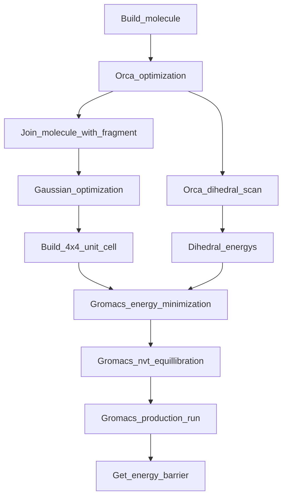
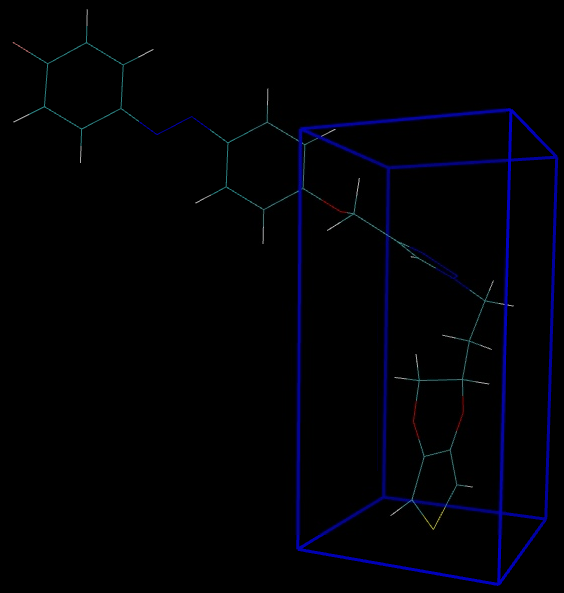
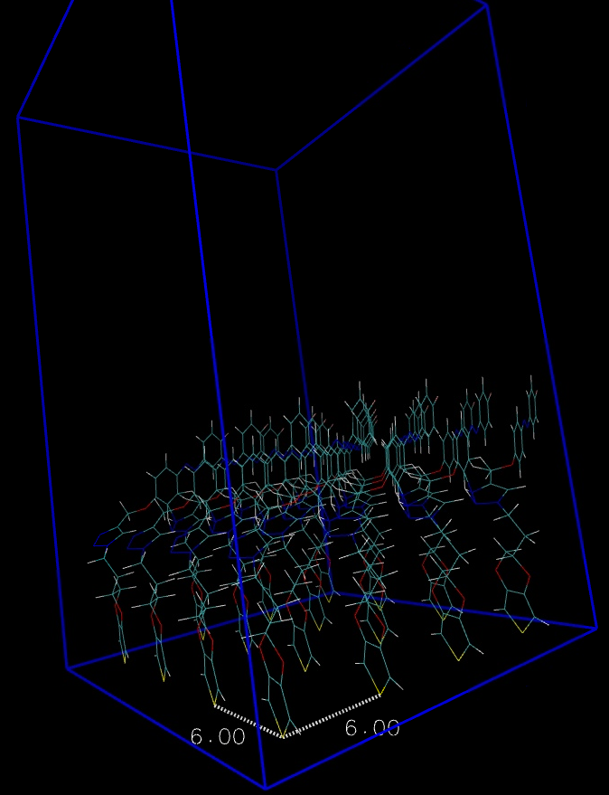

# Hi there!

## Table of content

1. Steps to complete a calculation
    1. [Build the molecule](#Building-a-Molecule) 
    2. [Perform a orca optimization](#performing-a-optimization-with-orca)
    3. [Adding a fragment and optimizing with Gaussian](#combining-your-molecule-with-a-fragment)
    4. [Preparing the Gromacs calculation](#using-amber-to-prepare-the-gromacs-calcualtion)
    5. [Perform a dihedral scan](#performing-a-dihedral-scan)
    6. [Calculation of torsion potenial](#generation-of-torsion-potential)
2. In Progress

##Steps to complete one calculation


### Building a Molecule
Building a molecule can be done in any program you choose. But the input file has to be in .xyz format.

### Performing a optimization with Orca
To perform the first optimization you need the .xyz file of your molecule and a input file which tells Orca what to do. The input file should look a bit like this:
```
orca.inp
! BP def2-SVP def2/J Opt UKS
%pal
nprocs 16
end

%geom
Constraints
{D 23 10 11 12 270.0 C } # D for Dihedral angle
end
end

* xyzfile 0 1 test.xyz
```
Additionally to the optimization, we lock the dihedral angle of the R-N-N-R bond at 270°. This is to simplify further calculations. We also read in the xyz-file in the same directory called test.xyz. For Orca calculations the **index of atoms start at 0!**

### Combining your molecule with a fragment
Your Molecule is cofined on a larger polymer backbone. To simulate the effects of this backbone we combine your molecule with a part of the backbone. There are again multiple ways to do this, Gaussview or any other. It is very important, that the **azobenzene unit is in its trans state**. Otherwise this will lead to errors further down the procedure.
This new structure is optimized using a gaussian calculation.
```
gauss.com
%Chk=exampleName.chk
#P RHF/6-31G* Opt

 Title

0 1
##Coordinates##


--Link1--
%Chk=exampleName.chk
#P HF/6-31G* SCF=Tight Geom=AllCheck Guess=Read
	Pop=MK IOp(6/33=2, 6/41=10, 6/42=17)
```
Diffent than in Orca we do not need a dedicated input file, all the instructions as well as the coordinates are provided in a .com file as seen above.

### Preparing the Gromacs calcualtion
The preperation comes in two parts. Firstly the generation of the requiered force field from the gaussian calculation. And secondly the generation of the torsion potential from the CNNC-dihedral.
- [Generation of input files using Amber](#using-amber-to-generate-input-files)
- [Generation of torsion potential](#generation-of-torsion-potential)

#### Using Amber to generate input files
We will use AmberTools to prepare our input files for the Gromacs calculation.
If you do not have a AmberTools installation we will use one provided via a conda package.
To get this environment up and running you can follow [THIS](http://ambermd.org/GetAmber.php) instruction.

Now that you have a  working AmberTools installation your can activate it by writing `conda activate AmberTools23` in your console.
Next we execute 2 commands:
`antechamber -fi gout -fo prepi -c resp -i gauss.log -o amber.prep -rn F1 -at gaff2`
`parmchk2 -i amber.prep -f prepi -o amber.frcmod`
For this to work your Gaussian out file (here gauss.log) has to be in the directory you try to run this script.

If everything worked you will notice that a few new files appeard. We are interested in the `NEWPDB.PDB`-file. This file contains your molecule from bevore which we have to place in a unitcell. You can do this by using the `pbc set {6.0 6.0 12.0} -all` command to definine the parameters and `pbc box` to show the cell. Now you have to place the molecule inside the box. This can be archieved by pressing `8` and the just dragging the molecule around. Rotation is possible by pressing and holding `SHIFT`. It is very important, that the molecule is fairly upright in the unitcell and that the atom which wil be held in position is at the bottom. This requieres some trial and error, the full documentation can be found [HERE](http://www.ks.uiuc.edu/Research/vmd/plugins/pbctools/).

<details>
  <summary>Click to see how it should look!</summary>
  
</details>     
<br/><br/>
Now that we have definde the unitcell, we can multiply our molecule using another AmberTools plugin. With the command `PropPDB -p SHIFTED.PDB -o NEWPDB4x4.PDB -ix 4 -iy 4 -iz 1` we create a 4x4x1 meaning 16 copys of our molecule. It is important, that there is no 2nd layer below or above, meaning where your chain would be.
<details>
  <summary>Click to see how it should look!</summary>
  
</details>     
<br/><br/>

Next we run `tleap -f tleap.in` which combines some of our previously created files. The mentioned `tleap.in` looks like this:
```
#tleap.in
source leaprc.gaff
loadAmberPrep amber.prep
loadamberparams amber.frcmod
SYS = loadpdb NEWPDB4x4.PDB
SaveAmberParm SYS System.prmtop System.inpcrd
quit
```

Lastly we convert the `System.prmtop` and `System.inpcrd` files into gromacs input files (.gro and .top) using the `parmed` libary in python.
```python
import parmed as pmd

amber = pmd.load_file('System.prmtop', 'System.inpcrd')

# Save a GROMACS topology and GRO file
amber.save('System.top')
amber.save('System.gro')
```
**This conversion will mess up the dimensions of th unitcell!**
To fix them again you have to change the last line in the `System.gro` file. If you also choose a distance of 6Å you have to change the line to `   2.40000   2.40000   5.00000` (gromacs uses *nm* instead of Å).


### Performing a dihedral scan
We can use the optimized structure from the first orca calculation to perform a scan around the R-N-N-R dihedral. To do this we set up 4 new calculations:

Calculation | multiplicity | angle
--- | --- |  --- |
1 | singlet| 270 -> 180 
2 | singlet | 270 -> 360
3 | triplet | 270 -> 180 
4 | triplet | 270 -> 360

Each calculation uses the optimized structure and a input file looking like this:
```
orca.inp
! BP def2-SVP def2/J Opt UKS
%pal
nprocs 16
end

%geom Scan
D 23 10 11 12 = 270, 180, 30
end
end

* xyzfile 0 1 orca_opt.xyz
```
This input file corresponds to the first calculation in the table above. 
`D 23 10 11 12 = 270, 180, 30`
We once again defined our dihedral angle (atoms 23, 10, 11 and  12) and defined that we would like to scan the angle from 270 to 180 in 30 steps. **The numeration of the atoms starts again at 0!**

`* xyzfile 0 1 orca_opt.xyz`
We also read the xyz-file, depending on the multiplicity of the calculation either a 1 or 3 is written here. (1:singlet, 3:triplett)

### Generation of torsion potential
After all the calculations have concludet we can combine the results and gain the complete potential. For every completed calculation you will gain a file called `*.relaxscanscf.dat` and `*.relaxscanact.dat` theses files contain in most cases the same information. I choose to use the `*.relaxscanscf.dat` for my calculations.
The content of the file looks like this:
```
#*.relaxscanscf.dat
 270.00000000 -671.47475117 
 273.10344828 -671.47457456 
 276.20689655 -671.47460869 
 279.31034483 -671.47484802 
...
 ```
Here the left row are the angeles and the right row are the corresponding energys.
To combine the energys and calculate the final energy we use the following python script.

<details>
  <summary>Python script</summary>

```python
from scipy.interpolate import CubicSpline
import numpy as np

#Read in all the files
sing_left = np.genfromtxt("relaxscanscf1.dat")
sing_right = np.genfromtxt("relaxscanscf2.dat")
trip_left = np.genfromtxt("relaxscansc3.dat")
trip_right = np.genfromtxt("relaxscansc4.dat")

#Combine the left and right calculations for both singlet and triplet, remove duplicates at 270°
sing = np.append(sing_left[::-1].T, sing_right[1:].T, axis=1)
trip = np.append(trip_left[::-1].T, trip_right[1:].T, axis=1)

#combine both calculations.
#At every angle both the triplet and singlet energy is compared and the lower of the two is kept.
energy_combined = np.where(sing[1]-trip[1] < 0, sing[1], trip[1])

phi = sing[0] #Read the angles into their own value
phi_renormalized = phi - phi[0] #Shift the angle range to 0
phi_ges = np.append(-phi_renormalized[::-1], phi_renormalized[1:]) #mirror the angle range (From -180 to +180)

#Normalize the energys to 0, and change the unit to kJ.
E_normal_in_kJ = (energy_combined - energy_combined.min()) *2625.5
#Mirror the energys
E_ges = np.append(E_normal_in_kJ, E_normal_in_kJ[-2::-1])

#Calculate a cubic spline to fit the curve.
cs = CubicSpline(phi_ges, E_ges, bc_type='periodic')
y = CubicSpline.__call__(cs, x = phi_ges, nu=1)
y_minus = y[::-1]

#save the file as "table_d0.xvg"
np.savetxt(f"table_d0.xvg", np.column_stack((phi_ges, E_ges, y_minus)), fmt="%12.8f\t %12.8f\t %12.8f")
```

</details>


### Gromacs
Test test