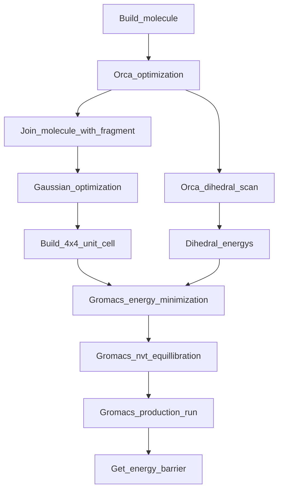

#Hi there

## Table of content

- Steps to complete a calculation
    1 [Build the molecule](#Building-a-Molecule) 
    2 [Perform a orca optimization](#performing-a-optimization-with-orca)
    3 [Perform a dihedral scan](#performing-a-dihedral-scan)
    4 [Adding a fragment and optimizing with Gaussian](#combining-your-molecule-with-a-fragment)
    5 [Preparing the Gromacs calculation](#using-amber-to-prepare-the-gromacs-calcualtion)

##Steps to complete one calculation


### Building a Molecule
Building a molecule can be done in any program you choose. But the input file has to be in .xyz format.

### Performing a optimization with Orca
To perform the first optimization you need the .xyz file of your molecule and a input file which tells Orca what to do. The input file should look a bit like this:
```
orca.inp
! BP def2-SVP def2/J Opt UKS
%pal
nprocs 16
end

%geom
Constraints
{D 23 10 11 12 270.0 C } # D for Dihedral angle
end
end

* xyzfile 0 1 test.xyz
```
Additionally to the optimization, we lock the dihedral angle of the R-N-N-R bond at 270°. This is to simplify further calculations. We also read in the xyz-file in the same directory called test.xyz.

### Performing a dihedral scan
After the pre-optimization has concluded, we can start the dihedral scan around the R-N-N-R dihedral. To do this we set up 4 new calculations:

Calculation | multiplicity | angle
--- | --- |  --- |
1 | singlet| 270 -> 180 
2 | singlet | 270 -> 360
3 | triplet | 270 -> 180 
4 | triplet | 270 -> 360

Each calculation uses the optimized structure and a input file looking like this:
```
orca.inp
! BP def2-SVP def2/J Opt UKS
%pal
nprocs 16
end

%geom Scan
D 23 10 11 12 = 270, 180, 30
end
end

* xyzfile 0 1 orca_opt.xyz
```
This input file corresponds to the first calculation in the table above. 
`D 23 10 11 12 = 270, 180, 30`
We once again defined our dihedral angle and defined that we would like to scan the angle from 270 to 180 in 30 steps.
`* xyzfile 0 1 orca_opt.xyz`
We also read the xyz-file, depending on the multiplicity of the calculation either a 1 or 3 is written here. (1:singlet, 3:triplett)

### Combining your molecule with a fragment
Your Molecule is cofined on a larger polymer backbone. To simulate the effects of this backbone we combine your molecule with a part of the backbone. There are again multiple ways to do this, Gaussview or any other. 
This new structure is optimized using a gaussian calculation.
```
gauss.com
%Chk=F1a_ortho.chk
#P RHF/6-31G* Opt

 Title

0 1
##Coordinates##


--Link1--
%Chk=F1a_ortho.chk
#P HF/6-31G* SCF=Tight Geom=AllCheck Guess=Read
	Pop=MK IOp(6/33=2, 6/41=10, 6/42=17)
```
Diffent than in Orca we do not need a dedicated input file, all the instructions as well as the coordinates are provided in a .com file like above.

### Using Amber to prepare the Gromacs calcualtion
We will use AmberTools to prepare our input files for the Gromacs calculation.
If you do not have a AmberTools installation we will use one provided via a conda package.
To get this environment up and running you can follow [THIS](http://ambermd.org/GetAmber.php) instruction.

Now that you have a  working AmberTools installation your can activate it by writing `conda activate AmberTools23` in your console.
Next we execute 2 commands:
`antechamber -fi gout -fo prepi -c resp -i gauss.log -o orca.prep -rn F1 -at gaff2`
`parmchk2 -i orca.prep -f prepi -o orca.frcmod`
For this to work your Gaussian out file (.log) has to be in the directory you try to run this script.

If everything worked you will notice that a few new files appeard. We are interested in the `NEWPDB.PDB`-file. This file contains your molecule from bevore which we have to place in a unitcell. You can apperantly do this with VMD