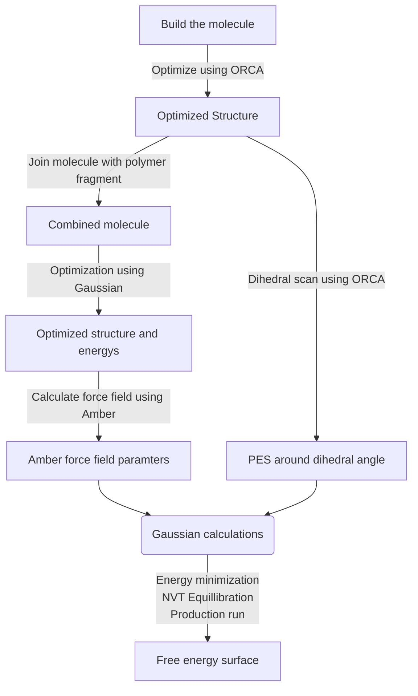

# Hi there!

## Table of content

  1. Steps to complete a calculation
    1. [Build the molecule](#Building-a-Molecule) 
    2. [Perform a orca optimization](#performing-a-optimization-with-orca)
    3. [Adding a fragment and optimizing with Gaussian](#combining-your-molecule-with-a-fragment)
    4. [Preparing the Gromacs calculation](#using-amber-to-prepare-the-gromacs-calcualtion)
    5. [Perform a dihedral scan](#performing-a-dihedral-scan)
    6. [Calculation of torsion potenial](#generation-of-torsion-potential)
    7. [Gromcas: Energy minimization](#energy-minimization)
    8. [Gromacs: NVT Equillibration](#nvt-equillibration)
    9. [Gromacs: Production](#production)
    10. [Analyzing results](#analyzing-results)
  2. [How to do it easier](/Program/README.md)

## Steps to complete one calculation


### Building a Molecule
Building a molecule can be done in any program you choose. But the input file has to be in .xyz format.

### Performing a optimization with Orca
To perform the first optimization you need the .xyz file of your molecule and a input file which tells Orca what to do. The input file should look a bit like this:
<details>
  <summary><b>orca.inp</b></summary>

```
! BP def2-SVP def2/J Opt UKS
%pal
nprocs 16
end

%geom
Constraints
{D 23 10 11 12 270.0 C } # D for Dihedral angle
end
end

* xyzfile 0 1 test.xyz
```
</details>  

Additionally to the optimization, we lock the dihedral angle of the R-N-N-R bond at 270°. This is to simplify further calculations. We also read in the xyz-file in the same directory called test.xyz. For Orca calculations the **index of atoms start at 0!**

### Combining your molecule with a fragment
Your Molecule is cofined on a larger polymer backbone. To simulate the effects of this backbone we combine your molecule with a part of the backbone. There are again multiple ways to do this, Gaussview or any other. It is very important, that the **azobenzene unit is in its trans state**. Otherwise this will lead to errors further down the procedure.
This new structure is optimized using a gaussian calculation.
<details>
  <summary><b>gauss.com</b></summary>

```
%Chk=exampleName.chk
#P RHF/6-31G* Opt

 Title

0 1
##Coordinates##


--Link1--
%Chk=exampleName.chk
#P HF/6-31G* SCF=Tight Geom=AllCheck Guess=Read
	Pop=MK IOp(6/33=2, 6/41=10, 6/42=17)
```
</details>     

Diffent than in Orca we do not need a dedicated input file, all the instructions as well as the coordinates are provided in a .com file as seen above.

### Preparing the Gromacs calcualtion
The preperation comes in two parts. Firstly the generation of the requiered force field from the gaussian calculation. And secondly the generation of the torsion potential from the CNNC-dihedral.
- [Generation of input files using Amber](#using-amber-to-generate-input-files)
- [Generation of torsion potential](#generation-of-torsion-potential)

#### Using Amber to generate input files
We will use AmberTools to prepare our input files for the Gromacs calculation.
If you do not have a AmberTools installation we will use one provided via a conda package.
To get this environment up and running you can follow [THIS](http://ambermd.org/GetAmber.php) instruction.

Now that you have a  working AmberTools installation your can activate it by writing `conda activate AmberTools23` in your console.
Next we execute 2 commands:
`antechamber -fi gout -fo prepi -c resp -i gauss.log -o amber.prep -rn F1 -at gaff2`
`parmchk2 -i amber.prep -f prepi -o amber.frcmod`
For this to work your Gaussian out file (here gauss.log) has to be in the directory you try to run this script.

If everything worked you will notice that a few new files appeard. We are interested in the `NEWPDB.PDB`-file. This file contains your molecule from bevore which we have to place in a unitcell. You can do this by using the `pbc set {6.0 6.0 12.0} -all` command to definine the parameters and `pbc box` to show the cell. Now you have to place the molecule inside the box. This can be archieved by pressing `8` and the just dragging the molecule around. Rotation is possible by pressing and holding `SHIFT`. It is very important, that the molecule is fairly upright in the unitcell and that the atom which wil be held in position is at the bottom. This requieres some trial and error, the full documentation can be found [HERE](http://www.ks.uiuc.edu/Research/vmd/plugins/pbctools/).

<details>
  <summary>Click to see how it should look!</summary>
  
</details>     
<br/><br/>
Now that we have definde the unitcell, we can multiply our molecule using another AmberTools plugin. With the command `PropPDB -p SHIFTED.PDB -o NEWPDB4x4.PDB -ix 4 -iy 4 -iz 1` we create a 4x4x1 meaning 16 copys of our molecule. It is important, that there is no 2nd layer below or above, meaning where your chain would be.
<details>
  <summary>Click to see how it should look!</summary>
  
</details>     
<br/><br/>

Next we run `tleap -f tleap.in` which combines some of our previously created files. The mentioned `tleap.in` looks like this:
<details>
  <summary><b>tleap.in</b></summary>

```
source leaprc.gaff
loadAmberPrep amber.prep
loadamberparams amber.frcmod
SYS = loadpdb NEWPDB4x4.PDB
SaveAmberParm SYS System.prmtop System.inpcrd
quit
```
</details>     
<br/><br/>


Lastly we convert the `System.prmtop` and `System.inpcrd` files into gromacs input files (.gro and .top) using the `parmed` libary in python.
```python
import parmed as pmd

amber = pmd.load_file('System.prmtop', 'System.inpcrd')

# Save a GROMACS topology and GRO file
amber.save('System.top')
amber.save('System.gro')
```
**This conversion will mess up the dimensions of th unitcell!**
To fix them again you have to change the last line in the `System.gro` file. If you also choose a distance of 6Å you have to change the line to `   2.40000   2.40000   5.00000` (gromacs uses *nm* instead of Å).


### Performing a dihedral scan
We can use the optimized structure from the first orca calculation to perform a scan around the R-N-N-R dihedral. To do this we set up 4 new calculations:

Calculation | multiplicity | angle
--- | --- |  --- |
1 | singlet| 270 -> 180 
2 | singlet | 270 -> 360
3 | triplet | 270 -> 180 
4 | triplet | 270 -> 360

Each calculation uses the optimized structure and a input file looking like this:
<details>
  <summary><b>orca.com</b></summary>

```
! BP def2-SVP def2/J Opt UKS
%pal
nprocs 16
end

%geom Scan
D 23 10 11 12 = 270, 180, 30
end
end

* xyzfile 0 1 orca_opt.xyz
```
</details>     


This input file corresponds to the first calculation in the table above. 
`D 23 10 11 12 = 270, 180, 30`
We once again defined our dihedral angle (atoms 23, 10, 11 and  12) and defined that we would like to scan the angle from 270 to 180 in 30 steps. **The numeration of the atoms starts again at 0!**

`* xyzfile 0 1 orca_opt.xyz`
We also read the xyz-file, depending on the multiplicity of the calculation either a 1 or 3 is written here. (1:singlet, 3:triplett)

### Generation of torsion potential
After all the calculations have concludet we can combine the results and gain the complete potential. For every completed calculation you will gain a file called `*.relaxscanscf.dat` and `*.relaxscanact.dat` theses files contain in most cases the same information. I choose to use the `*.relaxscanscf.dat` for my calculations.
The content of the file looks like this:
<details>
  <summary><b>*.relaxscanscf.dat</b></summary>

```
 270.00000000 -671.47475117 
 273.10344828 -671.47457456 
 276.20689655 -671.47460869 
 279.31034483 -671.47484802 
...
 ```
</details>     
<br/><br/>

Here the left row are the angeles and the right row are the corresponding energys.
To combine the energys and calculate the final energy we use the following python script.

<details>
  <summary>Python script</summary>

```python
from scipy.interpolate import CubicSpline
import numpy as np

#Read in all the files
sing_left = np.genfromtxt("relaxscanscf1.dat")
sing_right = np.genfromtxt("relaxscanscf2.dat")
trip_left = np.genfromtxt("relaxscansc3.dat")
trip_right = np.genfromtxt("relaxscansc4.dat")

#Combine the left and right calculations for both singlet and triplet, remove duplicates at 270°
sing = np.append(sing_left[::-1].T, sing_right[1:].T, axis=1)
trip = np.append(trip_left[::-1].T, trip_right[1:].T, axis=1)

#combine both calculations.
#At every angle both the triplet and singlet energy is compared and the lower of the two is kept.
energy_combined = np.where(sing[1]-trip[1] < 0, sing[1], trip[1])

phi = sing[0] #Read the angles into their own value
phi_renormalized = phi - phi[0] #Shift the angle range to 0
phi_ges = np.append(-phi_renormalized[::-1], phi_renormalized[1:]) #mirror the angle range (From -180 to +180)

#Normalize the energys to 0, and change the unit to kJ.
E_normal_in_kJ = (energy_combined - energy_combined.min()) *2625.5
#Mirror the energys
E_ges = np.append(E_normal_in_kJ, E_normal_in_kJ[-2::-1])

#Calculate a cubic spline to fit the curve.
cs = CubicSpline(phi_ges, E_ges, bc_type='periodic')
y = CubicSpline.__call__(cs, x = phi_ges, nu=1)
y_minus = y[::-1]

#save the file as "table_d0.xvg"
np.savetxt(f"table_d0.xvg", np.column_stack((phi_ges, E_ges, y_minus)), fmt="%12.8f\t %12.8f\t %12.8f")
```
</details>

This will result in a file called `table_d0.xvg` which we will need later.

## Gromacs
One Gromacs calculation is seperated in three parts:
- Energy minimization
  - The system is relaxed and a starting point for further calculations is set.
- Equillibration
  - the system is brougt to the desired temperature
- Production
  - The simulation is run for a specific amount of time to observe some mechanism

A very good introduction can be found [HERE](http://www.mdtutorials.com/gmx/lysozyme/05_EM.html)
For most of these steps Gromacs and Plumed have to be installed and available.

### Energy minimization
Bevore we can start the calculation we need a few files:
- *.top
- *.gro
- posre.itp
- em.mdp

We already have the `*.top` and `*.gro` file from the [Amber Step](#using-amber-to-generate-input-files).
In the `posre.itp` we tell Gromacs which atoms to freeze in the simulation. In our case this would be the *CSC* triangle at the bottom of our molecule.
<details>
  <summary><b>posre.itp</b></summary>

```
[ position_restraints ]
; atom  type      fx      fy      fz
52      1       1000000    1000000    1000000
51      1       1000000    1000000    1000000
49      1       1000000    1000000    1000000
```
</details>   

Everything in Gromacs uses an **index starting from 1!**
To actualy use this restriction we have to modify the `*.top` file.
Here we have to add the following lines directly above the [ bonds ] keyword.
```
#ifdef POSRES
#include "posre.itp"
#endif
```
<details>
  <summary><b>like this</b></summary>

```
   ...
   52         cd      1     F1    C22     52 -0.44223400  12.010000   ; qtot -0.273620
   53         h4      1     F1    H20     53 0.27362100   1.008000   ; qtot 0.000001

#ifdef POSRES
#include "posre.itp"
#endif

[ bonds ]
;    ai     aj funct         c0         c1         c2         c3
     51     52     1   0.17562 222421.440000
     49     51     1   0.17562 222421.440000
     ...
```
</details> 
<br/><br/>

The last thing we have to do is write the instruction file `em.mdp`, this tells Gromacs what to do in the calculation.
It looks like this:
<details>
  <summary><b>em.mdp</b></summary>

```
title = Energy Minimization

define = -DPOSRES  ; Define position restraints

; minim.mdp - used as input into grompp to generate em.tpr
integrator	= steep		; Algorithm (steep = steepest descent minimization)
emtol		= 100.0  	; Stop minimization when the maximum force < 1000.0 kJ/mol/nm
emstep          = 0.01          ; Energy step size
nsteps		= 500000	  	; Maximum number of (minimization) steps to perform

; Parameters describing how to find the neighbors of each atom and how to calculate the interactions
nstlist		    = 15                 ; Frequency to update the neighbor list and long range forces
cutoff-scheme       = Verlet
ns_type		    = grid		; Method to determine neighbor list (simple, grid)
coulombtype	    = PME		; Treatment of long range electrostatic interactions
rcoulomb	    = 1.0		; Short-range electrostatic cut-off
rvdw		    = 1.0		; Short-range Van der Waals cut-off
pbc		    = xyz 		; Periodic Boundary Conditions (yes/no)

; Output control
nstxout             = 100
nstvout             = 1000
nstenergy           = 1000
nstlog              = 1000
```
</details> 


Now we are ready to start our calculation!
First we generate the gromacs input file (`em.tpr`) using this command:
`gmx grompp -f em.mdp -c System.gro -p System.top -r System.gro -o em.tpr`
Now we can start the calculation using:
`gmx mdrun -v -deffnm em`
If you get a weird error, try adding `-ntmpi 1` at the end. This restricts Gromacs to one thread, but fixes some errors.

### NVT Equillibration
For our usecase of a 2D polymer only a NVT equillibration is performed. As our structure is only 2 dimensional we have included extra space in the unitcell above the molecule. If we where to perform a pressure equillibration (npt) this would invalidate our system by removing this extra space.

For the NVT equillibration we mostly need the same files as bevore:
- *.top
- em.gro
- posre.itp
- nvt.mdp

We use the same `*.top` and `posre.itp` file as bevore, but we switch to the optimized em.gro structure. The new `nvt.mdp` looks like this:
<details>
  <summary><b>nvt.mdp</b></summary>

```
title               = equilibration NVT
define              = -DPOSRES
; Run parameters
integrator          = md
nsteps              = 400000
dt                  = 0.001
; Output control
nstxout             = 1000
nstvout             = 1000
nstenergy           = 1000
nstlog              = 1000
; Neighborsearching and short-range nonbonded interactions
cutoff-scheme       = Verlet
nstlist             = 20
ns_type             = grid
pbc                 = xyz
rlist               = 0.5
; Electrostatics
coulombtype         = PME
pme_order           = 4
fourierspacing      = 0.16
ewald_rtol          = 1e-05
; Temperature coupling
tcoupl              = V-rescale
tc-grps             = system
tau_t               = 0.1
ref_t               = 310
; Pressure coupling
Pcoupl              = no
; Velocity generation
gen_vel             = yes
gen_temp            = 310
gen_seed            = -1
; Bond parameters
constraint_algorithm    = lincs         ; holonomic constraints
constraints             = h-bonds       ; all bonds (even heavy atom-H bonds) constrained
lincs_iter              = 1             ; accuracy of LINCS
lincs_order             = 4             ; also related to accuracy
; Simulated annealing
annealing	= single 	    ; single sequence of points for each T-coupling group
annealing_npoints	= 2		        ; two points - start and end temperatures
annealing_time 	= 0 400   	    ; time frame of heating - heat over period of 500 ps
annealing_temp	= 0 310 	   
```
</details> 

We once again generate the input (`nvt.tpr`) file using:
`gmx grompp -f nvt.mdp -c em.gro -p System.top -r em.gro -o nvt.tpr`
And start the calculation with:
`gmx mdrun -v -deffnm nvt`

### Production
For the production run we need (bold == new):
- *.top
- nvt.gro
- posre.itp
- prod.mdp
- **table_fourier.itp***
- **table_d0.xvg**
- **plumed.dat**

The file `table_fourier.itp` tella gromacs what atoms should use our newly calculated torsion potential.
<details>
  <summary><b>table_fourier.itp</b></summary>

```
; ai    aj    ak    al  funct   n   k
11   12   13   14       8       0   1      
```
</details> 

`ai`, `aj`, `ak` and `al` are the index of every atom that takes part in the dihedral.
(Once again, **Gromacs starts its indexing at 1!**)

The `table_do.xvg` contains the actual dihedral potential calculated [HERE](#generation-of-torsion-potential).

Lastly the `plumed.dat` contains information on the well-tempered metadynamics taking place in the run.
<details>
  <summary><b>plumed.dat</b></summary>

```
UNITS LENGTH=A TIME=0.001

t: TORSION ATOMS=350,351,352,353
a: ALPHABETA ATOMS1=350,351,352,353 REFERENCE=3.14
METAD ...
 LABEL=metad
 ARG=t
 PACE=200
 HEIGHT=1.0
 SIGMA=0.1
 GRID_MIN=-pi
 GRID_MAX=pi
 GRID_BIN=100
 CALC_RCT
 FILE=HILLS
 BIASFACTOR=60
 TEMP=310.0
... METAD


PRINT FILE=COLVAR ARG=t,a,metad.*
FLUSH STRIDE=1
```
</details> 

In this file you have to edit the following lines:
```
t: TORSION ATOMS=350,351,352,353
a: ALPHABETA ATOMS1=350,351,352,353
```
Here you have to once again replace the numbers with the indexes of the atoms participating in the *CNNC* dihedral. The selection is somewhat arbituary, we choose a molecule which was not directly at a border to make further visualization easyer.
This will write two files `COLVAR` and `HILLS`.
Further information on PLUMED can be found [HERE](https://www.plumed.org/doc-v2.9/user-doc/html/_m_e_t_a_d.html).

No we are ready to generate one finaly input file using:
`gmx grompp -f prod.mdp -c nvt.gro -r nvt.gro -p System.top -o prod.tpr`

And start the Job with:
`gmx mdrun -s prod.tpr -v -deffnm prod -ntomp 1 -plumed plumed.dat -tableb table_d0.xvg`

Depending on your system this might take a while, for me every run was about 12 hours, while calculating on the Cluster.

### Analyzing results
You can do two things to analyze your gromacs calculation:
1. Generate a movie showing your structure moving around.
2. Show specific bonds, angels, etc. during the simulation
3. Analyze the output from plumed

#### 1. Generate a movie
You can generate a movie using the following command:
`gmx trjconv -f  prod.xtc -s prod.tpr -o snapshots.pdb`
If there is no `.xtc` file a `.trr` file can be used instead.
This creates a snapshots.pdb file which can be viewed using `vmd`.

#### 2. Show specific dihedrals
First you have to generate a index file for the atoms you are interested in. You can do this by using the command:
`gmx mk_angndx -s prod.tpr -type dihedral`
The full documentation for all the different modules under gromacs can be found [HERE](https://manual.gromacs.org/current/onlinehelp/gmx-angle.html).

To analyze the dihedral angles you can use the following command:
`gmx angle -f prod.xtc -type dihedral`

The final `.xvg` file can be analyzed via different means.


#### 3. Analyze the plumed output
You can analyze the `HILLS` file using:
`plumed sum_hills --hills HILLS --outfile HILLSOUT.dat`
The file `HILLSOUT.dat` contains three rows.
First are the angles, then the energys and lastly the errors.

To visualize the data you can use the following script:
<details>
  <summary><b>visualize.py</b></summary>

```python
def openHills(fileName):
    with open(fileName) as file:
        [file.readline() for x in range(5)]
        data = np.fromfile(file, sep= " ", dtype=float)
    phi, energy, error = data.reshape(-1,3).T
    phi = (phi/np.pi)*180
    energy = energy - energy.min()
    return phi, energy, error

def genData(fileNames:dict[str,str]):
    for fileName in fileNames.keys():
        data = openHills(fileName)
        label = fileNames[fileName]
        yield data, label

fileNames= {
    "fileName": "Label",
}

fig, ax = plt.subplots()
ax.set_xlim(-180, 180)
ax.set_ylim(0, 210)
ax.set_xticks([x for x in range(-180, 181, 60)])
for data, label in genData(fileNames):
    ax.plot(data[0], data[1], label = label)
ax.legend();
```
</details> 

Just replace `fileName` with the name of the file containing your data and `label` with a label you want to give your data.